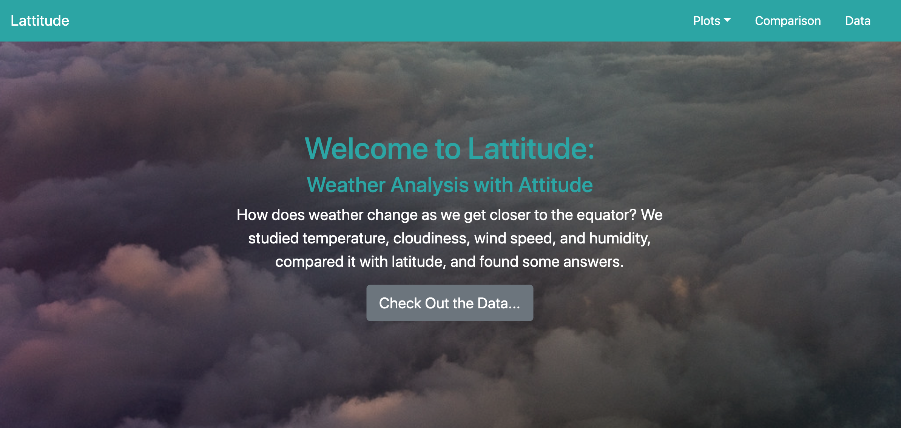

# Weather Dashboard | A data visualization website

A web dashboard/visualization presenting analysis of a weather dataset using HTML/CSS/JavaScript, as well as Bootstrap components, responsive design and media queries.

## This website is deployed to GitHub Pages @ faedra.github.io/Weather-Data-Dashboard/

### Project Description:

In building this dashboard, I displayed a set of weather plots for comparison and analysis, with the focus being ease of navigation. To do this, I needed to create individual pages for each plot and a means by which to navigate between them. I also built a landing page, a page displaying a comparison of all plots, a page displaying the source data, and a navigation menu with dropdowns where appropriate.

As mentioned above, this visualization relies on a responsive bootstrap grid, which transforms based on screen width. Specifically the project uses the bootstrap `navbar` component for the header on every page, the bootstrap `table` component for the data page, and the bootstrap grid for responsiveness on the comparison page, along with a CSS media query for the navigation menu.

### Technology Stack Used: Web Dev Tools

* HTML
* CSS
* JavaScript
* Bootstrap

### Screenshot: 
[Live site available at this link...](https://faedra.github.io/Weather-Data-Dashboard/)

